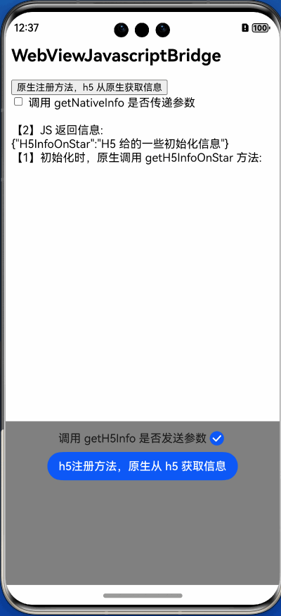

# WebViewJavascriptBridge

## 背景介绍
WebViewJavascriptBridge 在 HarmonyOS 上的实现。

本库基于 iOS/Mac 开发者经常会用到的 [WebViewJavascriptBridge](https://github.com/marcuswestin/WebViewJavascriptBridge) 进行分析，然后在鸿蒙上实现。

通过本库可以让鸿蒙原生与 JavaScript 完成交互，方便的相互调用彼此函数。

[WebViewJavascriptBridge](https://github.com/marcuswestin/WebViewJavascriptBridge) 是盛名已久的 JSBridge 库，早在 2011 年就被其作者 Marcus Westin 发布到 GitHub 上，因其代码逻辑清晰，风格良好，加上自身代码量比较小使得其源码阅读非常轻松，广为流传…… ~~吧啦吧啦吧啦~~

主要是现有项目（iOS、Android、H5 ）均使用了此库的逻辑，鸿蒙上的开发也不会另起炉灶，于是就有了本库。



## 相关特性
* 适配 HarmonyOS，API 10+
* 逻辑简单，使用方便，不影响原先 Web 组件
* 支持控制台打印调试
* 使用方式与开发 iOS/Mac 类似
* ...


## 安装使用
ohpm 安装：
```
ohpm install @yue/webview_javascript_bridge
```
或者 `oh-package.json5` 中有本库的依赖。
```
"dependencies": {
  "@yue/webview_javascript_bridge": "^1.0.0"
}
```

使用：
### 鸿蒙端：
1. 在 Web 组件的 `onControllerAttached` 回调中创建 `WebViewJavascriptBridge` 对象，然后在 `onLoadIntercept` 中响应 bridge 拦截事件，这样桥接就已经建立了。

```typescript
Web({
  xxxxx
})
  .onControllerAttached(() => {
    // WebviewController 载入完成后，设置 WebViewJavascriptBridge
    this.bridge = new WebViewJavascriptBridge(this.webviewController);
  })
  .onLoadIntercept((event) => {
    const url = event.data.getRequestUrl();
    // 符合 WebViewJavascriptBridge 的链接规则才拦截
    if (this.bridge?.bridgeInterceptWithURL(url)) {
      return true;
    }
    return false;
  })
```

2. 原生注册方法，供 JS 调用

```typescript
// 注册 getNativeInfo 方法，供 JS 调用
// data 为 JS 调用此方法时传递的参数
// responseCallback() 里的 jsonStr 则返回给 JS
this.bridge.registerHandler('getNativeInfo', 
  (data: Object, responseCallback: WVJBResponseCallback) => {
    responseCallback(jsonStr)
  });
```

3. H5 已有方法，原生调用

```typescript
// JS 已注册过 getH5Info 方法，原生来调用
// responseData 为 JS 给的数据
this.bridge.callHandler({handlerName: 'getH5Info', 
  responseCallback: (responseData) => {
      this.toast("原生调用 getH5Info \n接收到结果：" +
      WebViewJavascriptBridgeTools.jsonStringify(responseData));
    }
  })
```

### JS 端
```javascript
// 初始化 WebViewJavascriptBridge
function setupWebViewJavascriptBridge(callback) {
	  if (window.WebViewJavascriptBridge) { return callback(WebViewJavascriptBridge); }
	  if (window.WVJBCallbacks) { return window.WVJBCallbacks.push(callback); }
	  window.WVJBCallbacks = [callback];
	  var WVJBIframe = document.createElement('iframe');
	  WVJBIframe.style.display = 'none';
	  WVJBIframe.src = 'https://__bridge_loaded__';
	  document.documentElement.appendChild(WVJBIframe);
	  setTimeout(function () { document.documentElement.removeChild(WVJBIframe) }, 0)
}

// 注册方法，给原生调用
setupWebViewJavascriptBridge(function (bridge) {
    bridge.registerHandler('getH5Info', function (data, responseCallback) {
        console.log('原生调用 getH5Info 方法传递的参数', JSON.stringify(data))
        // JS 返回给原生的数据
        var responseData = { 'H5Info': 'xxxxx' }
        responseCallback(responseData)
    })
})

// JS 调用原生端注册的方法
function testGetNativeInfo() {
    setupWebViewJavascriptBridge(function(bridge) {
        bridge.callHandler('getNativeInfo', { 'key': 'value' }, function (response) {
    			  console.log('JS 获取到原生侧给的数据', response)
    		})
    })
}
```

## 详细示例
### 鸿蒙原生侧
确保 oh-package.json5 中有本库的依赖。
```
"dependencies": {
  "@yue/webview_javascript_bridge": "^1.0.0"
}
```

ets 文件
```typescript
import { webview } from '@kit.ArkWeb';
import {
  WebViewJavascriptBridge,
  WebViewJavascriptBridgeTools,
  WVJBResponseCallback,
} from '@yue/WebViewJavascriptBridge';
import { promptAction } from '@kit.ArkUI';

@Entry
@Component
struct Index {
  // WebviewController
  private _controller: webview.WebviewController = new webview.WebviewController();
  // WebViewJavascriptBridge 桥接
  private _bridge: WebViewJavascriptBridge | undefined;

  build() {
    Column() {
      this.webView();
      this.actionView();
    }
    .width('100%')
    .height('100%')
  }

  @Builder
  private actionView() {
    Column() {
      Row() {
      Button('h5注册方法，原生从 h5 获取信息').onClick(() => {
        this._getH5Info();
      })
    }
    .width('100%')
    .height('30%')
    .backgroundColor(Color.Gray)
  }

  @Builder
  private webView() {
    Web({
      src: $rawfile('index.html'),
      controller: this._controller,
    })
      .width('100%')
      .height('70%')
      .domStorageAccess(true)
      .onControllerAttached(() => {
        // WebviewController 载入完成后，设置 WebViewJavascriptBridge
        this.setupWebViewJavascriptBridge();
      })
      .onAlert((event) => {
        AlertDialog.show({ message: event?.message })
        return false;
      })
      .onLoadIntercept((event) => {
        const url = event.data.getRequestUrl();
        // 符合 WebViewJavascriptBridge 的链接规则才拦截
        if (this._bridge?.bridgeInterceptWithURL(url)) {
          return true;
        }
        return false;
      });
  }

  /**
   * 设置 jsBridge
   */
  private setupWebViewJavascriptBridge() {
    // 开启调试，控制台打印信息，默认无调试
    WebViewJavascriptBridge.enableLogging();
    // 创建 WebViewJavascriptBridge
    this._bridge = new WebViewJavascriptBridge(this._controller);
    // 创建后，可注册相关方法
    this._bridge.registerHandler('getNativeInfo', (data: Object, responseCallback: WVJBResponseCallback) => {
      if (data) {
        this._toast("JS 调用 getNativeInfo \n原生接收到参数：" + WebViewJavascriptBridgeTools.jsonStringify(data));
      }
      // 返回数据
      let map: Record<string, Record<string, string>> = {
        "deviceInfo": {
          "types": "harmony",
          "debug": "1",
        },
        "userInfo": {
          "userId": "666666",
          "member_name": "用户名",
        }
      }
      const jsonStr: string = WebViewJavascriptBridgeTools.jsonStringify(map);
      responseCallback(jsonStr);
    });
  }

  private _getH5Info() {
    let arg = new Map<string, string | Map<string, string>>([
      ["key", "1"],
    ]);

    this._bridge?.callHandler({
      handlerName: 'getH5Info',
      data: arg,
      responseCallback: (responseData) => {
        this._toast(WebViewJavascriptBridgeTools.jsonStringify(responseData));
      }
    });
  }

  private _toast(msg: string) {
    promptAction.showToast({
      message: msg,
      duration: 4000
    });
  }
}
```

### JS侧
```javascript
<!Document>
	<html>

	<head>
		<meta charset="UTF-8" />
		<meta name="viewport" content="width=device-width, initial-scale=1.0">
		<meta content="yes" name="apple-mobile-web-app-capable" />
		<meta content="yes" name="apple-touch-fullscreen" />
		<meta content="telephone=no" name="format-detection" />
		<title>WebViewJavascriptBridge</title>
	</head>

	<body>
		<script>
			window.onerror = function (err) {
				log('window.onerror 出错: ' + err)
			}

			function setupWebViewJavascriptBridge(callback) {
				if (window.WebViewJavascriptBridge) { return callback(WebViewJavascriptBridge); }
				if (window.WVJBCallbacks) { return window.WVJBCallbacks.push(callback); }
				window.WVJBCallbacks = [callback];
				var WVJBIframe = document.createElement('iframe');
				WVJBIframe.style.display = 'none';
				WVJBIframe.src = 'https://__bridge_loaded__';
				document.documentElement.appendChild(WVJBIframe);
				setTimeout(function () { document.documentElement.removeChild(WVJBIframe) }, 0)
			}

			setupWebViewJavascriptBridge(function (bridge) {
				var uniqueId = 1
				function log(message, data) {
					var log = document.getElementById('log')
					var el = document.createElement('div')
					var dataStr = data ? JSON.stringify(data) : ""
					el.className = 'logLine'
					el.innerHTML = '【' + uniqueId++ + '】' + message + ':<br/>' + dataStr + '<br/>'
					if (log.children.length) { log.insertBefore(el, log.children[0]) }
					else { log.appendChild(el) }
				}

				bridge.registerHandler('getH5Info', function (data, responseCallback) {
					log('原生调用 getH5Info 方法', data)
					var responseData = { 'H5Info': '运行时 H5 给的另一些信息', '参数': JSON.stringify(data) }
					log('JS 返回信息', responseData)
					responseCallback(responseData)
				})

				document.body.appendChild(document.createElement('br'))

				var callbackButton = document.getElementById('buttons').appendChild(document.createElement('button'))
				callbackButton.innerHTML = '原生注册方法，h5 从原生获取信息'
				callbackButton.onclick = function (e) {
					e.preventDefault()
					log('JS 调用方法 "getNativeInfo" 方法')
					bridge.callHandler('getNativeInfo', { 'key': 'value' }, function (response) {
						log('JS 获取到数据', response)
					})
				}
			});
		</script>

		<h2>WebViewJavascriptBridge</h2>

		<div id='buttons'></div>
		<br/>
		<div id='log'></div>

	</body>

	</html>
```


